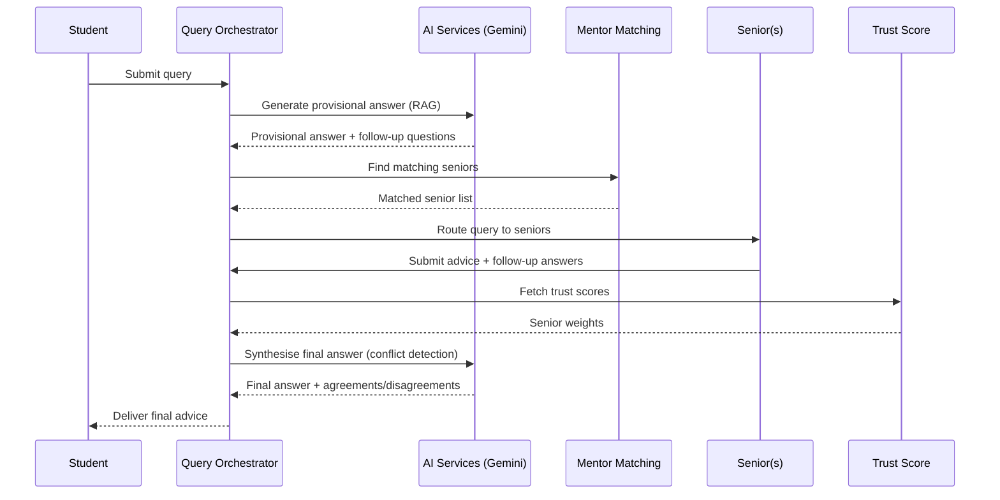

<div align="center">

# 🔦 BEACON

### Peer Mentoring Platform for Students

*Connecting students with experienced seniors through intelligent matching, trust-scored advice, and AI-augmented query resolution.*

[](https://www.djangoproject.com/)
[](https://react.dev/)
[](https://neo4j.com/)
[](https://ai.google.dev/)

</div>

---

## 📌 Problem Statement

Students entering college often struggle to find reliable, domain-specific guidance. Traditional mentoring programs suffer from poor matching, inconsistent quality, and information overload. **Beacon** solves this by building an intelligent, trust-scored peer mentoring network — where seniors' advice is weighted by verified achievements and past track records, queries are augmented by AI, and conflicts across multiple mentors are surfaced transparently.

---

## ✨ Key Features

| Feature | Description |
|---|---|
| **🔐 Google OAuth + JWT Auth** | Secure sign-in with Google, role-based access (Student / Senior), refresh-token rotation with blacklisting |
| **👤 Rich User Profiles** | Achievement tracking, domain tagging, experience levels, and availability management |
| **🧠 AI-Powered Query Pipeline** | Submit questions → get instant provisional answers from Google Gemini → route to matched seniors → synthesise final advice |
| **🤝 Intelligent Mentor Matching** | 2-hop graph traversal on Neo4j + Pinecone embedding similarity to surface the best-fit seniors and peers |
| **⚖️ Trust Score Engine** | Multi-factor trust score (consistency, alignment, follow-through, achievement weight) to rank advice quality |
| **⚔️ Conflict Detection** | Automatically detects disagreements across senior responses and highlights areas of consensus |
| **💬 Direct Messaging** | Real-time 1-on-1 conversations between students and seniors with request/accept flow |
| **📅 Adaptive Scheduler** | Celery-powered load balancing, cold-start broadcasting, and fair query distribution |
| **🌐 Domain Graph** | Neo4j-backed knowledge graph of academic/career domains with embedding-based linking via Pinecone |

---

## 🏗️ Architecture

```
┌──────────────────────────────────────────────────────────────────┐
│                        React 18 + Vite                          │
│               Zustand State │ React Router │ Axios              │
└────────────────────────────┬─────────────────────────────────────┘
                             │  REST API (JWT)
┌────────────────────────────▼─────────────────────────────────────┐
│                  Django 4.2 + DRF Backend                        │
│                                                                  │
│  ┌────────────┐ ┌──────────────┐ ┌───────────────────────────┐   │
│  │ Auth       │ │ User Profile │ │ Domain Management         │   │
│  │ Service    │ │ Service      │ │ Service (Neo4j + Pinecone)│   │
│  └────────────┘ └──────────────┘ └───────────────────────────┘   │
│  ┌────────────────┐ ┌──────────────┐ ┌────────────────────────┐  │
│  │ Mentor Matching│ │ Trust Score  │ │ Query Orchestrator     │  │
│  │ Service        │ │ Service      │ │ + AI Services (Gemini) │  │
│  └────────────────┘ └──────────────┘ └────────────────────────┘  │
│  ┌────────────────────┐ ┌────────────────────────────────────┐   │
│  │ Direct Messaging   │ │ Adaptive Scheduler (Celery+Redis) │   │
│  │ Service            │ │                                    │   │
│  └────────────────────┘ └────────────────────────────────────┘   │
└──────────────────────────────────────────────────────────────────┘
         │              │               │
    ┌────▼───┐    ┌─────▼────┐    ┌─────▼────┐
    │ SQLite │    │  Neo4j   │    │ Pinecone │
    │ / PgSQL│    │  Aura    │    │ (Vector) │
    └────────┘    └──────────┘    └──────────┘
```

### Tech Stack

| Layer | Technology |
|---|---|
| **Frontend** | React 18, Vite 5, Zustand, React Router 6, Axios |
| **Backend** | Django 4.2, Django REST Framework, SimpleJWT |
| **Graph DB** | Neo4j 5 Aura (via neomodel) |
| **Vector DB** | Pinecone |
| **SQL DB** | SQLite (dev) / PostgreSQL 15 (prod) |
| **Task Queue** | Celery 5 + Redis |
| **AI / LLM** | Google Gemini (via `google-genai`) |
| **Auth** | Google OAuth 2.0, JWT (access + refresh) |
| **Embeddings** | Sentence Transformers |

---

## 📁 Project Structure

```
beacon/
├── backend/                        # Django project root
│   ├── beacon/                     # Project settings, URLs, WSGI
│   │   ├── settings.py
│   │   ├── urls.py
│   │   └── wsgi.py
│   ├── apps/                       # Microservice-style Django apps
│   │   ├── auth_service/           # User registration, Google OAuth, JWT
│   │   ├── user_profile_service/   # Profiles, achievements, experience levels
│   │   ├── domain_management_service/  # Neo4j domain graph + Pinecone embeddings
│   │   ├── mentor_matching_service/    # 2-hop graph matching engine
│   │   ├── trust_score_service/    # Multi-factor trust scoring
│   │   ├── query_orchestrator/     # Query lifecycle management
│   │   ├── ai_services/           # Gemini RAG engine, conflict detection
│   │   ├── adaptive_scheduler_service/ # Celery load-balancing tasks
│   │   └── direct_messaging_service/   # 1-on-1 DM with request/accept
│   ├── manage.py
│   ├── requirements.txt
│   └── seed_neo4j.py              # Graph database seeding script
├── frontend/                       # React + Vite SPA
│   ├── src/
│   │   ├── api/                   # Axios API modules (auth, query, messaging…)
│   │   ├── store/                 # Zustand stores (authStore, queryStore)
│   │   ├── pages/                 # Route-level views
│   │   │   ├── AuthPage.jsx       # Login / Register
│   │   │   ├── StudentDashboard.jsx
│   │   │   ├── SeniorDashboard.jsx
│   │   │   ├── ProfilePage.jsx
│   │   │   ├── QueryPage.jsx      # AI-powered Q&A interface
│   │   │   ├── MentorMatchPage.jsx
│   │   │   ├── MessagingPage.jsx
│   │   │   ├── SeniorInboxPage.jsx
│   │   │   └── SeniorOnboardingPage.jsx
│   │   └── components/            # Reusable UI components
│   │       ├── Navbar.jsx
│   │       ├── QueryCard.jsx
│   │       ├── MentorCard.jsx
│   │       ├── PeerCard.jsx
│   │       ├── TrustScoreBadge.jsx
│   │       ├── ConflictAlert.jsx
│   │       ├── ProvisionalAnswerBox.jsx
│   │       └── Aurora.jsx         # Background visual effects
│   ├── package.json
│   └── vite.config.js
└── shared/
    └── schemas.md                 # JSON API contracts
```

---

## 🚀 Quick Start

### Prerequisites

- Python 3.10+
- Node.js 18+
- Redis (for Celery)
- Neo4j Aura instance (or local Neo4j 5)
- Pinecone account
- Google Cloud project (for OAuth + Gemini API key)

### 1. Clone & Configure

```bash
git clone https://github.com/your-org/beacon.git
cd beacon
cp .env.example .env
# Fill in: SECRET_KEY, NEO4J_*, PINECONE_API_KEY, GEMINI_API_KEY, GOOGLE_OAUTH_CLIENT_ID
```

### 2. Backend Setup

```bash
cd backend
python -m venv venv
source venv/bin/activate        # Windows: venv\Scripts\activate
pip install -r requirements.txt

python manage.py migrate
python seed_neo4j.py            # Seed the domain graph
python manage.py runserver
```

### 3. Frontend Setup

```bash
cd frontend
npm install
npm run dev                     # Starts at http://localhost:5173
```

### 4. Celery Worker (for Adaptive Scheduler)

```bash
cd backend
celery -A beacon worker --loglevel=info
```

---

## 🔗 API Endpoints

| Prefix | Service | Description |
|---|---|---|
| `api/auth/` | Auth Service | Register, login, Google OAuth, token refresh |
| `api/profile/` | User Profile | CRUD profiles, achievements, experience levels |
| `api/domains/` | Domain Management | Domain graph queries, embedding-based linking |
| `api/` | Mentor Matching | Find mentors & peers (graph + vector search) |
| `api/query/` | Query Orchestrator | Submit queries, track status, get AI answers |
| `api/scheduler/` | Adaptive Scheduler | Load balancing, cold-start broadcast |
| `api/dm/` | Direct Messaging | Send/receive messages, manage conversations |
| `internal/trust-score/` | Trust Score | Internal trust score computation |
| `internal/users/` | Internal Auth | Service-to-service user lookups |
| `internal/profile/` | Internal Profile | Service-to-service profile lookups |

> Full JSON schemas for all requests/responses are documented in [`shared/schemas.md`](shared/schemas.md).

---

## 🧪 Testing

```bash
cd backend

# AI services tests
python -m pytest test_ai_services.py -v

# Neo4j integration tests
python -m pytest test_neo4j.py -v

# Query orchestrator tests
python -m pytest test_query_orchestrator.py -v

# User profile service tests
python -m pytest test_user_profile_service.py -v
```

---

## 🔐 Environment Variables

| Variable | Description |
|---|---|
| `SECRET_KEY` | Django secret key |
| `DEBUG` | Enable debug mode (`True` / `False`) |
| `NEO4J_HOST` | Neo4j Aura hostname |
| `NEO4J_USERNAME` | Neo4j username |
| `NEO4J_PASSWORD` | Neo4j password |
| `PINECONE_API_KEY` | Pinecone API key |
| `PINECONE_INDEX` | Pinecone index name (default: `beacon-domains`) |
| `GEMINI_API_KEY` | Google Gemini API key |
| `GOOGLE_OAUTH_CLIENT_ID` | Google OAuth client ID |
| `REDIS_URL` | Redis connection URL (for Celery) |
| `POSTGRES_DB` / `POSTGRES_USER` / `POSTGRES_PASSWORD` | PostgreSQL credentials (prod) |
| `INTERNAL_SECRET` | Shared secret for service-to-service auth |

---

## 🛠️ How It Works

### Query Lifecycle



### Mentor Matching Algorithm

1. **Domain Linking** — Student's query domain is embedded via Sentence Transformers and matched against the Pinecone vector index
2. **Graph Traversal** — 2-hop traversal on the Neo4j domain graph to find seniors with related expertise
3. **Trust-Weighted Ranking** — Candidates are ranked by composite trust score (consistency × alignment × follow-through × achievement weight)
4. **Load Balancing** — Adaptive scheduler ensures fair distribution; cold-start broadcasting is used when no seniors are immediately available

---

## 👥 Roles

| Role | Capabilities |
|---|---|
| **Student** | Ask questions, view AI answers, browse mentors/peers, message seniors, track profile |
| **Senior** | Receive routed queries, submit advice, manage availability, onboard with domains, accept DM requests |

---
