# Module 3 — Query Orchestrator & AI Services: Complete Implementation Guide

## Overview

Module 3 is the **brain** of BEACON. It handles the end-to-end lifecycle of a student query: from submission → AI-powered provisional answer → senior dispatch → conflict detection → weighted synthesis → final response.

```mermaid
flowchart LR
    A[Student Query] --> B[EmbeddingGenerator]
    B --> C[RAGEngine]
    C --> D[Provisional Answer]
    D --> E[MentorMatching]
    E --> F[Senior Inbox]
    F --> G[Senior Response]
    G --> H[ConflictEngine]
    H --> I[LLMSynthesizer]
    I --> J[Final Answer]
    J --> K[TrustScore Update]
```



### Files to Implement

| File | Purpose |
|------|---------|
| `query_orchestrator/models.py` | Django models: `Query`, `ConflictRecord`, `SeniorQueryAssignment` |
| `query_orchestrator/serializers.py` | DRF serializers for all request/response schemas |
| `query_orchestrator/views.py` | 4 API views (submit, status, senior-response, pending) |
| `query_orchestrator/orchestrator.py` | Central pipeline coordinator |
| `query_orchestrator/urls.py` | *(already done — no changes needed)* |
| `query_orchestrator/services/client.py` | Internal HTTP client |
| `ai_services/embedding_generator.py` | OpenAI embeddings + Pinecone storage |
| `ai_services/rag_engine.py` | Retrieval-Augmented Generation |
| `ai_services/llm_synthesizer.py` | Weighted advice aggregation via LLM |
| `ai_services/conflict_consensus_engine.py` | Anomaly/conflict detection |

### Dependencies on Other Modules

| Dependency | What Module 3 Needs | How |
|------------|---------------------|-----|
| Module 1 — `auth_service` | User model (ForeignKey) | Direct import |
| Module 2 — `mentor_matching_service` | `MentorMatchingEngine.find_mentors()` | Direct import or internal HTTP |
| Module 2 — `trust_score_service` | `TrustScoreCalculator.update_feedback()` | Internal HTTP call |
| External — OpenAI | Embeddings + Chat completions | `openai` Python SDK |
| External — Pinecone | Vector storage & similarity search | `pinecone-client` SDK |

---

## Phase 1: Models & Serializers

### 1.1 `query_orchestrator/models.py`

```python
from django.db import models
from django.conf import settings
import uuid


class Query(models.Model):
    """Stores a student query and its resolution state."""
    
    STATUS_CHOICES = [
        ('PENDING', 'Pending'),
        ('IN_PROGRESS', 'In Progress'),
        ('RESOLVED', 'Resolved'),
    ]

    id = models.UUIDField(primary_key=True, default=uuid.uuid4, editable=False)
    student = models.ForeignKey(
        settings.AUTH_USER_MODEL, on_delete=models.CASCADE,
        related_name='queries'
    )
    domain_id = models.UUIDField()  # References DomainNode in Neo4j
    content = models.TextField()
    embedding_vector_id = models.CharField(max_length=255, blank=True, default='')
    status = models.CharField(max_length=20, choices=STATUS_CHOICES, default='PENDING')
    rag_response = models.TextField(blank=True, default='')
    final_response = models.TextField(blank=True, default='')
    follow_up_questions = models.JSONField(default=list)
    matched_seniors = models.JSONField(default=list)  # List of senior UUIDs
    is_resolved = models.BooleanField(default=False)
    timestamp = models.DateTimeField(auto_now_add=True)

    class Meta:
        app_label = 'query_orchestrator'
        ordering = ['-timestamp']

    def __str__(self):
        return f"Query {self.id} by {self.student_id} — {self.status}"


class ConflictRecord(models.Model):
    """Stores detected conflicts between senior advice items."""
    
    id = models.UUIDField(primary_key=True, default=uuid.uuid4, editable=False)
    query = models.ForeignKey(Query, on_delete=models.CASCADE, related_name='conflicts')
    new_advice = models.TextField()
    conflicting_advice = models.TextField()
    flagged_at = models.DateTimeField(auto_now_add=True)

    class Meta:
        app_label = 'query_orchestrator'

    def __str__(self):
        return f"Conflict on Query {self.query_id} at {self.flagged_at}"


class SeniorQueryAssignment(models.Model):
    """Tracks which seniors are assigned to which queries."""
    
    STATUS_CHOICES = [
        ('PENDING', 'Pending'),
        ('RESPONDED', 'Responded'),
        ('SKIPPED', 'Skipped'),
    ]

    id = models.UUIDField(primary_key=True, default=uuid.uuid4, editable=False)
    query = models.ForeignKey(Query, on_delete=models.CASCADE, related_name='assignments')
    senior = models.ForeignKey(
        settings.AUTH_USER_MODEL, on_delete=models.CASCADE,
        related_name='query_assignments'
    )
    status = models.CharField(max_length=20, choices=STATUS_CHOICES, default='PENDING')
    advice_content = models.TextField(blank=True, default='')
    answered_followups = models.JSONField(default=list)
    trust_score_at_response = models.FloatField(default=0.0)
    similarity_score = models.FloatField(default=0.0)
    responded_at = models.DateTimeField(null=True, blank=True)
    assigned_at = models.DateTimeField(auto_now_add=True)

    class Meta:
        app_label = 'query_orchestrator'
        unique_together = ('query', 'senior')

    def __str__(self):
        return f"Assignment {self.senior_id} → Query {self.query_id} [{self.status}]"
```

> [!IMPORTANT]
> After writing models, run:
> ```bash
> python manage.py makemigrations query_orchestrator
> python manage.py migrate
> ```

### 1.2 `query_orchestrator/serializers.py`

```python
from rest_framework import serializers


class QuerySubmitRequestSerializer(serializers.Serializer):
    student_id = serializers.UUIDField()
    domain_id = serializers.UUIDField()
    content = serializers.CharField()


class QuerySubmitResponseSerializer(serializers.Serializer):
    query_id = serializers.UUIDField()
    status = serializers.CharField()
    provisional_answer = serializers.CharField(allow_blank=True)
    follow_up_questions = serializers.ListField(child=serializers.CharField())
    matched_seniors = serializers.ListField(child=serializers.UUIDField())
    timestamp = serializers.DateTimeField()


class AnsweredFollowupSerializer(serializers.Serializer):
    question = serializers.CharField()
    answer = serializers.CharField()


class SeniorResponseRequestSerializer(serializers.Serializer):
    senior_id = serializers.UUIDField()
    advice_content = serializers.CharField()
    answered_followups = AnsweredFollowupSerializer(many=True, required=False, default=[])


class ContributingSeniorSerializer(serializers.Serializer):
    senior_id = serializers.UUIDField()
    trust_score = serializers.FloatField()
    weight = serializers.FloatField()


class FinalAdviceResponseSerializer(serializers.Serializer):
    query_id = serializers.UUIDField()
    final_answer = serializers.CharField()
    agreements = serializers.ListField(child=serializers.CharField())
    disagreements = serializers.ListField(child=serializers.CharField())
    conflict_detected = serializers.BooleanField()
    conflict_details = serializers.CharField(allow_null=True)
    contributing_seniors = ContributingSeniorSerializer(many=True)


class QueryStatusResponseSerializer(serializers.Serializer):
    query_id = serializers.UUIDField()
    status = serializers.CharField()
    provisional_answer = serializers.CharField(allow_null=True)
    final_answer = serializers.CharField(allow_null=True)
    follow_up_questions = serializers.ListField(child=serializers.CharField())
    conflict_detected = serializers.BooleanField()
```

---

## Phase 2: AI Services (the engine room)

### 2.1 `ai_services/embedding_generator.py`

```python
import os
from openai import OpenAI
from pinecone import Pinecone, ServerlessSpec
from django.conf import settings


class EmbeddingGenerator:
    """
    Wraps OpenAI text-embedding-ada-002 and Pinecone vector storage.
    Index: "beacon-domains"
    """

    def __init__(self):
        self.openai_client = OpenAI(api_key=settings.OPENAI_API_KEY)
        self.pc = Pinecone(api_key=settings.PINECONE_API_KEY)
        self.index_name = settings.PINECONE_INDEX

        # Create index if it doesn't exist
        if self.index_name not in [idx.name for idx in self.pc.list_indexes()]:
            self.pc.create_index(
                name=self.index_name,
                dimension=1536,
                metric='cosine',
                spec=ServerlessSpec(cloud='aws', region=settings.PINECONE_ENV or 'us-east-1')
            )
        self.index = self.pc.Index(self.index_name)

    def generate(self, text: str) -> list:
        """
        Calls OpenAI embedding API.
        Returns: embedding vector list[float] (length 1536)
        """
        response = self.openai_client.embeddings.create(
            input=text,
            model="text-embedding-ada-002"
        )
        return response.data[0].embedding

    def store(self, vector_id: str, embedding: list, metadata: dict) -> bool:
        """
        Upserts embedding into Pinecone.
        metadata keys: domain_name, type, domain_id, query_text, advice_text, senior_id, trust_score
        """
        self.index.upsert(vectors=[(vector_id, embedding, metadata)])
        return True

    def query_similar(self, embedding: list, top_k: int = 5, filter: dict = None) -> list:
        """
        Queries Pinecone for top_k similar vectors.
        Returns: list of { id, score, metadata }
        """
        results = self.index.query(
            vector=embedding,
            top_k=top_k,
            filter=filter,
            include_metadata=True
        )
        return [
            {
                'id': match.id,
                'score': match.score,
                'metadata': match.metadata
            }
            for match in results.matches
        ]
```

### 2.2 `ai_services/rag_engine.py`

```python
from django.conf import settings
from openai import OpenAI
from apps.ai_services.embedding_generator import EmbeddingGenerator


class RAGEngine:
    """
    Retrieval-Augmented Generation engine.
    Retrieves similar past Q&A pairs from Pinecone, feeds to LLM for provisional answer.
    """

    def __init__(self):
        self.embedding_gen = EmbeddingGenerator()
        self.openai_client = OpenAI(api_key=settings.OPENAI_API_KEY)

    def retrieve_similar_cases(self, query_embedding: list, domain_id: str) -> list:
        """
        Queries Pinecone filtered by domain_id.
        Returns: list of { query_text, advice_text, trust_score, senior_id }
        """
        results = self.embedding_gen.query_similar(
            embedding=query_embedding,
            top_k=5,
            filter={"domain_id": str(domain_id)}
        )
        return [
            {
                'query_text': r['metadata'].get('query_text', ''),
                'advice_text': r['metadata'].get('advice_text', ''),
                'trust_score': r['metadata'].get('trust_score', 0.0),
                'senior_id': r['metadata'].get('senior_id', ''),
                'similarity_score': r['score']
            }
            for r in results
            if r['metadata'].get('advice_text')  # Only return entries with advice
        ]

    def generate_provisional_response(self, student_query: str, similar_cases: list,
                                       high_trust_advice: list) -> str:
        """
        Builds prompt from retrieved context + high-trust advice.
        Calls LLM API.
        Returns: provisional answer string (includes disclaimer)
        """
        # Build context from similar past cases
        context_parts = []
        for i, case in enumerate(similar_cases[:3], 1):
            context_parts.append(
                f"Past Case {i} (trust: {case['trust_score']:.2f}):\n"
                f"  Q: {case['query_text']}\n"
                f"  A: {case['advice_text']}"
            )

        # Build context from high-trust advice
        advice_parts = []
        for i, advice in enumerate(high_trust_advice[:3], 1):
            advice_parts.append(
                f"Senior Advice {i} (trust: {advice['trust_score']:.2f}): {advice['advice_text']}"
            )

        context_text = "\n\n".join(context_parts) if context_parts else "No similar past cases found."
        advice_text = "\n".join(advice_parts) if advice_parts else "No high-trust advice available yet."

        prompt = f"""You are BEACON, an AI mentoring assistant. A student has asked a question.
Based on similar past questions and trusted senior advice, provide a helpful provisional answer.

STUDENT QUESTION:
{student_query}

SIMILAR PAST CASES:
{context_text}

HIGH-TRUST SENIOR ADVICE:
{advice_text}

Provide a clear, helpful answer. End with a disclaimer that this is a provisional AI-generated response
and a verified senior mentor will review and provide personalized guidance soon."""

        response = self.openai_client.chat.completions.create(
            model="gpt-4o-mini",
            messages=[{"role": "user", "content": prompt}],
            max_tokens=600,
            temperature=0.7
        )
        return response.choices[0].message.content
```

### 2.3 `ai_services/llm_synthesizer.py`

```python
from django.conf import settings
from openai import OpenAI


class LLMSynthesizer:
    """
    Weighted aggregation of multiple senior advice items.
    Weight formula: trust_score × similarity_score
    """

    def __init__(self):
        self.openai_client = OpenAI(api_key=settings.OPENAI_API_KEY)

    def compute_weight(self, trust_score: float, similarity_score: float) -> float:
        """Returns: weight float (product of trust and similarity)."""
        return trust_score * similarity_score

    def synthesize(self, student_query: str, advice_list: list) -> dict:
        """
        advice_list items: { content, senior_id, trust_score, similarity_score }
        Builds LLM prompt, calls API, returns synthesized answer.
        Returns: { final_answer, agreements, disagreements }
        """
        if not advice_list:
            return {
                'final_answer': 'No senior responses received yet.',
                'agreements': [],
                'disagreements': []
            }

        # Compute weights and sort by weight descending
        weighted_advice = []
        for advice in advice_list:
            weight = self.compute_weight(
                advice.get('trust_score', 0.5),
                advice.get('similarity_score', 0.5)
            )
            weighted_advice.append({**advice, 'weight': weight})
        weighted_advice.sort(key=lambda x: x['weight'], reverse=True)

        # Build prompt
        advice_text = ""
        for i, a in enumerate(weighted_advice, 1):
            advice_text += (
                f"\nAdvisor {i} (weight: {a['weight']:.3f}, trust: {a['trust_score']:.2f}):\n"
                f"{a['content']}\n"
            )

        prompt = f"""You are BEACON's synthesis engine. Multiple senior mentors have provided advice
for a student's question. Synthesize their responses into a single coherent answer.

STUDENT QUESTION: {student_query}

SENIOR RESPONSES (ordered by weight/trustworthiness):
{advice_text}

Instructions:
1. Synthesize a final comprehensive answer, weighting higher-trust responses more heavily
2. Identify key points where advisors AGREE
3. Identify any points where advisors DISAGREE

Respond in EXACTLY this JSON format:
{{
  "final_answer": "Your synthesized answer here",
  "agreements": ["point 1 they agree on", "point 2 they agree on"],
  "disagreements": ["point where they disagree, if any"]
}}"""

        response = self.openai_client.chat.completions.create(
            model="gpt-4o-mini",
            messages=[{"role": "user", "content": prompt}],
            max_tokens=800,
            temperature=0.3,
            response_format={"type": "json_object"}
        )

        import json
        result = json.loads(response.choices[0].message.content)
        return {
            'final_answer': result.get('final_answer', ''),
            'agreements': result.get('agreements', []),
            'disagreements': result.get('disagreements', [])
        }

    def generate_followup_questions(self, query_content: str, domain_id: str) -> list:
        """
        Generates predictive follow-up questions the student might ask next.
        Returns: list of question strings (max 3)
        """
        prompt = f"""Based on this student question, predict 3 follow-up questions they might ask next.
Keep questions specific and actionable.

Student question: {query_content}

Return ONLY a JSON array of 3 strings, no other text:
["question 1", "question 2", "question 3"]"""

        response = self.openai_client.chat.completions.create(
            model="gpt-4o-mini",
            messages=[{"role": "user", "content": prompt}],
            max_tokens=200,
            temperature=0.5,
            response_format={"type": "json_object"}
        )

        import json
        try:
            result = json.loads(response.choices[0].message.content)
            # Handle both {"questions": [...]} and [...] formats
            if isinstance(result, list):
                return result[:3]
            if isinstance(result, dict):
                return list(result.values())[0][:3] if result else []
        except (json.JSONDecodeError, IndexError, KeyError):
            return []
        return []
```

### 2.4 `ai_services/conflict_consensus_engine.py`

```python
import numpy as np
from apps.ai_services.embedding_generator import EmbeddingGenerator
from apps.query_orchestrator.models import ConflictRecord


class ConflictConsensusEngine:
    """
    Detects when new senior advice contradicts historical trends.
    Uses embedding cosine similarity to measure deviation.
    Threshold for anomaly: avg_similarity < 0.3
    """
    ANOMALY_THRESHOLD = 0.3

    def __init__(self):
        self.embedding_gen = EmbeddingGenerator()

    @staticmethod
    def _cosine_similarity(vec_a: list, vec_b: list) -> float:
        """Compute cosine similarity between two vectors."""
        a = np.array(vec_a)
        b = np.array(vec_b)
        dot = np.dot(a, b)
        norm = np.linalg.norm(a) * np.linalg.norm(b)
        return float(dot / norm) if norm > 0 else 0.0

    def detect_anomaly(self, new_advice: str, historical_advice: list) -> bool:
        """
        Embeds new_advice and each item in historical_advice.
        Computes average cosine similarity.
        Returns: True if anomaly detected (avg_similarity < threshold)
        """
        if not historical_advice:
            return False  # Can't detect anomaly without history

        new_embedding = self.embedding_gen.generate(new_advice)

        similarities = []
        for past_advice in historical_advice:
            past_embedding = self.embedding_gen.generate(past_advice)
            sim = self._cosine_similarity(new_embedding, past_embedding)
            similarities.append(sim)

        avg_similarity = sum(similarities) / len(similarities)
        return avg_similarity < self.ANOMALY_THRESHOLD

    def flag_conflict(self, query_id: str, new_advice: str, conflicting_advice: str) -> dict:
        """
        Stores ConflictRecord in PostgreSQL.
        Returns: ConflictRecord dict
        """
        record = ConflictRecord.objects.create(
            query_id=query_id,
            new_advice=new_advice,
            conflicting_advice=conflicting_advice
        )
        return {
            'id': str(record.id),
            'query_id': str(record.query_id),
            'new_advice': record.new_advice,
            'conflicting_advice': record.conflicting_advice,
            'flagged_at': record.flagged_at.isoformat()
        }
```

> [!TIP]
> Add `numpy` to `requirements.txt` — it's needed by `ConflictConsensusEngine` for cosine similarity.

---

## Phase 3: Orchestrator (the brain)

### 3.1 `query_orchestrator/orchestrator.py`

```python
from django.utils import timezone
from apps.ai_services.embedding_generator import EmbeddingGenerator
from apps.ai_services.rag_engine import RAGEngine
from apps.ai_services.llm_synthesizer import LLMSynthesizer
from apps.ai_services.conflict_consensus_engine import ConflictConsensusEngine
from apps.query_orchestrator.models import Query, SeniorQueryAssignment
from apps.mentor_matching_service.matching_engine import MentorMatchingEngine


class QueryOrchestrator:
    """
    Central coordinator for query processing pipeline.
    Connects: EmbeddingGenerator → RAGEngine → MentorMatching →
              SeniorInbox → ConflictEngine → LLMSynthesizer
    """

    def __init__(self):
        self.embedding_gen = EmbeddingGenerator()
        self.rag_engine = RAGEngine()
        self.synthesizer = LLMSynthesizer()
        self.conflict_engine = ConflictConsensusEngine()
        self.matching_engine = MentorMatchingEngine()

    def handle_new_query(self, student_id: str, domain_id: str, content: str) -> dict:
        """
        Full pipeline for a new student query.
        Returns: QuerySubmitResponse dict
        """
        # Step 1: Generate embedding
        query_embedding = self.embedding_gen.generate(content)

        # Step 2: Retrieve similar past cases
        similar_cases = self.rag_engine.retrieve_similar_cases(query_embedding, domain_id)

        # Step 3: Generate provisional LLM answer
        high_trust = [c for c in similar_cases if c.get('trust_score', 0) > 0.7]
        provisional_answer = self.rag_engine.generate_provisional_response(
            content, similar_cases, high_trust
        )

        # Step 4: Generate follow-up questions
        followups = self.synthesizer.generate_followup_questions(content, domain_id)

        # Step 5: Find matched seniors
        matched = self.matching_engine.find_mentors(student_id, domain_id, priority=1)
        matched_senior_ids = [m['senior_id'] for m in matched]

        # Step 6: Save Query to PostgreSQL
        query = Query.objects.create(
            student_id=student_id,
            domain_id=domain_id,
            content=content,
            embedding_vector_id='',  # Could store Pinecone vector ID
            status='PENDING',
            rag_response=provisional_answer,
            follow_up_questions=followups,
            matched_seniors=matched_senior_ids
        )

        # Step 7: Store query embedding in Pinecone for future RAG retrieval
        self.embedding_gen.store(
            vector_id=str(query.id),
            embedding=query_embedding,
            metadata={
                'domain_id': str(domain_id),
                'query_text': content,
                'type': 'query'
            }
        )

        # Step 8: Create senior assignments (dispatch to inboxes)
        for senior_id in matched_senior_ids:
            SeniorQueryAssignment.objects.create(
                query=query,
                senior_id=senior_id
            )

        return {
            'query_id': str(query.id),
            'status': query.status,
            'provisional_answer': provisional_answer,
            'follow_up_questions': followups,
            'matched_seniors': [str(sid) for sid in matched_senior_ids],
            'timestamp': query.timestamp.isoformat()
        }

    def handle_senior_response(self, senior_id: str, query_id: str,
                                advice_content: str, answered_followups: list) -> dict:
        """
        Pipeline when a senior submits a response.
        Returns: FinalAdviceResponse dict
        """
        query = Query.objects.get(id=query_id)

        # Step 1: Record the senior's response
        assignment = SeniorQueryAssignment.objects.get(query=query, senior_id=senior_id)
        assignment.advice_content = advice_content
        assignment.answered_followups = answered_followups
        assignment.status = 'RESPONDED'
        assignment.responded_at = timezone.now()
        # Get senior's trust score
        from apps.auth_service.models import User
        senior = User.objects.get(id=senior_id)
        assignment.trust_score_at_response = senior.trust_score
        assignment.save()

        # Step 2: Conflict detection — compare against other responses
        other_responses = SeniorQueryAssignment.objects.filter(
            query=query, status='RESPONDED'
        ).exclude(senior_id=senior_id)

        historical_advice = [r.advice_content for r in other_responses if r.advice_content]
        conflict_detected = False
        conflict_details = None

        if historical_advice:
            conflict_detected = self.conflict_engine.detect_anomaly(
                advice_content, historical_advice
            )
            if conflict_detected:
                conflict_record = self.conflict_engine.flag_conflict(
                    query_id=str(query.id),
                    new_advice=advice_content,
                    conflicting_advice=historical_advice[0]  # Most recent conflicting
                )
                conflict_details = (
                    f"Conflict detected between senior {senior_id}'s advice and "
                    f"previous responses. Record ID: {conflict_record['id']}"
                )

        # Step 3: Gather ALL responses and synthesize
        all_responses = SeniorQueryAssignment.objects.filter(
            query=query, status='RESPONDED'
        )

        advice_list = [
            {
                'content': r.advice_content,
                'senior_id': str(r.senior_id),
                'trust_score': r.trust_score_at_response,
                'similarity_score': r.similarity_score or 0.5
            }
            for r in all_responses
        ]

        # Synthesize using LLM
        synthesis = self.synthesizer.synthesize(query.content, advice_list)

        # Step 4: Update query as resolved
        query.final_response = synthesis['final_answer']
        query.is_resolved = True
        query.status = 'RESOLVED'
        query.save()

        # Step 5: Store resolved Q&A in Pinecone for future RAG
        qa_embedding = self.embedding_gen.generate(
            f"Q: {query.content}\nA: {synthesis['final_answer']}"
        )
        self.embedding_gen.store(
            vector_id=f"{query.id}_resolved",
            embedding=qa_embedding,
            metadata={
                'domain_id': str(query.domain_id),
                'query_text': query.content,
                'advice_text': synthesis['final_answer'],
                'senior_id': str(senior_id),
                'trust_score': senior.trust_score,
                'type': 'resolved_qa'
            }
        )

        # Step 6: Update trust score (call trust_score_service)
        # NOTE: In production, this would be an internal HTTP call:
        # requests.post(f'{INTERNAL_URL}/internal/trust-score/update-feedback/', ...)
        # For now, direct import approach:
        try:
            from apps.trust_score_service.calculator import TrustScoreCalculator
            trust_calc = TrustScoreCalculator()
            trust_calc.update_feedback(str(senior_id), {
                'query_id': str(query.id),
                'responded': True,
                'follow_through': len(answered_followups) > 0
            })
        except Exception:
            pass  # Don't fail the main flow if trust update fails

        # Build contributing seniors list
        contributing = [
            {
                'senior_id': str(r.senior_id),
                'trust_score': r.trust_score_at_response,
                'weight': self.synthesizer.compute_weight(
                    r.trust_score_at_response, r.similarity_score or 0.5
                )
            }
            for r in all_responses
        ]

        return {
            'query_id': str(query.id),
            'final_answer': synthesis['final_answer'],
            'agreements': synthesis['agreements'],
            'disagreements': synthesis['disagreements'],
            'conflict_detected': conflict_detected,
            'conflict_details': conflict_details,
            'contributing_seniors': contributing
        }
```

---

## Phase 4: Views (API layer)

### 4.1 `query_orchestrator/views.py`

```python
from rest_framework.views import APIView
from rest_framework.response import Response
from rest_framework import status
from rest_framework.permissions import IsAuthenticated
from .serializers import (
    QuerySubmitRequestSerializer,
    QuerySubmitResponseSerializer,
    SeniorResponseRequestSerializer,
    FinalAdviceResponseSerializer,
    QueryStatusResponseSerializer,
)
from .orchestrator import QueryOrchestrator
from .models import Query, SeniorQueryAssignment


class SubmitQueryView(APIView):
    """
    POST /api/query/submit/
    Input:  QuerySubmitRequest { student_id, domain_id, content }
    Output: QuerySubmitResponse
    """
    def post(self, request):
        serializer = QuerySubmitRequestSerializer(data=request.data)
        serializer.is_valid(raise_exception=True)

        orchestrator = QueryOrchestrator()
        result = orchestrator.handle_new_query(
            student_id=str(serializer.validated_data['student_id']),
            domain_id=str(serializer.validated_data['domain_id']),
            content=serializer.validated_data['content']
        )

        response_serializer = QuerySubmitResponseSerializer(result)
        return Response(response_serializer.data, status=status.HTTP_201_CREATED)


class QueryStatusView(APIView):
    """
    GET /api/query/<query_id>/status/
    Output: QueryStatusResponse
    """
    def get(self, request, query_id):
        try:
            query = Query.objects.get(id=query_id)
        except Query.DoesNotExist:
            return Response({'error': 'Query not found'}, status=status.HTTP_404_NOT_FOUND)

        result = {
            'query_id': str(query.id),
            'status': query.status,
            'provisional_answer': query.rag_response or None,
            'final_answer': query.final_response or None,
            'follow_up_questions': query.follow_up_questions,
            'conflict_detected': query.conflicts.exists()
        }

        serializer = QueryStatusResponseSerializer(result)
        return Response(serializer.data)


class SeniorResponseView(APIView):
    """
    POST /api/query/<query_id>/senior-response/
    Input:  SeniorResponseRequest
    Output: FinalAdviceResponse
    """
    def post(self, request, query_id):
        serializer = SeniorResponseRequestSerializer(data=request.data)
        serializer.is_valid(raise_exception=True)

        orchestrator = QueryOrchestrator()
        result = orchestrator.handle_senior_response(
            senior_id=str(serializer.validated_data['senior_id']),
            query_id=str(query_id),
            advice_content=serializer.validated_data['advice_content'],
            answered_followups=serializer.validated_data.get('answered_followups', [])
        )

        response_serializer = FinalAdviceResponseSerializer(result)
        return Response(response_serializer.data)


class SeniorPendingQueriesView(APIView):
    """
    GET /api/query/pending/senior/<senior_id>/
    Output: list of pending QuerySubmitResponse objects
    """
    def get(self, request, senior_id):
        pending = SeniorQueryAssignment.objects.filter(
            senior_id=senior_id,
            status='PENDING'
        ).select_related('query')  # N.B.: query is FK, this optimizes

        results = []
        for assignment in pending:
            q = assignment.query  # ForeignKey access
            results.append({
                'query_id': str(q.id),
                'status': q.status,
                'provisional_answer': q.rag_response or '',
                'follow_up_questions': q.follow_up_questions,
                'matched_seniors': q.matched_seniors,
                'timestamp': q.timestamp.isoformat()
            })

        serializer = QuerySubmitResponseSerializer(results, many=True)
        return Response(serializer.data)
```

---

## Phase 5: Frontend Pages

### 5.1 `pages/QueryPage.jsx` — Student query submission

```jsx
import React, { useState } from 'react';

export default function QueryPage() {
  const [content, setContent] = useState('');
  const [domainId, setDomainId] = useState('');
  const [result, setResult] = useState(null);
  const [loading, setLoading] = useState(false);
  const [polling, setPolling] = useState(false);

  const submitQuery = async () => {
    setLoading(true);
    try {
      const res = await fetch('/api/query/submit/', {
        method: 'POST',
        headers: { 'Content-Type': 'application/json' },
        body: JSON.stringify({
          student_id: 'CURRENT_USER_ID',  // Replace with auth store
          domain_id: domainId,
          content
        }),
      });
      const data = await res.json();
      setResult(data);
      // Start polling for status updates
      if (data.query_id) pollStatus(data.query_id);
    } catch (err) {
      console.error(err);
    }
    setLoading(false);
  };

  const pollStatus = async (queryId) => {
    setPolling(true);
    const interval = setInterval(async () => {
      const res = await fetch(`/api/query/${queryId}/status/`);
      const data = await res.json();
      setResult(prev => ({ ...prev, ...data }));
      if (data.status === 'RESOLVED') {
        clearInterval(interval);
        setPolling(false);
      }
    }, 5000); // Poll every 5 seconds
  };

  return null; // TODO: Build full UI using result state
}
```

### 5.2 `pages/SeniorInboxPage.jsx` — Senior response interface

```jsx
import React, { useEffect, useState } from 'react';

export default function SeniorInboxPage() {
  const [pending, setPending] = useState([]);
  const [response, setResponse] = useState('');
  const [selectedQuery, setSelectedQuery] = useState(null);

  useEffect(() => {
    fetchPending();
  }, []);

  const fetchPending = async () => {
    const seniorId = 'CURRENT_USER_ID'; // Replace with auth store
    const res = await fetch(`/api/query/pending/senior/${seniorId}/`);
    const data = await res.json();
    setPending(data);
  };

  const submitResponse = async (queryId) => {
    const res = await fetch(`/api/query/${queryId}/senior-response/`, {
      method: 'POST',
      headers: { 'Content-Type': 'application/json' },
      body: JSON.stringify({
        senior_id: 'CURRENT_USER_ID',
        advice_content: response,
        answered_followups: []
      }),
    });
    const data = await res.json();
    // Handle final advice response
    setSelectedQuery(null);
    setResponse('');
    fetchPending(); // Refresh list
  };

  return null; // TODO: Build full UI
}
```

---

## Phase 6: Checklist & Verification

### Implementation Order

```
1. ☐ ai_services/embedding_generator.py    (no dependencies)
2. ☐ ai_services/rag_engine.py             (depends on 1)
3. ☐ ai_services/llm_synthesizer.py        (depends on OpenAI only)
4. ☐ ai_services/conflict_consensus_engine  (depends on 1)
5. ☐ query_orchestrator/models.py           (depends on auth_service.User)
6. ☐ query_orchestrator/serializers.py      (depends on 5)
7. ☐ query_orchestrator/orchestrator.py     (depends on 1-4, 5, MentorMatchingEngine)
8. ☐ query_orchestrator/views.py            (depends on 6-7)
9. ☐ Run migrations
10. ☐ Frontend: QueryPage.jsx
11. ☐ Frontend: SeniorInboxPage.jsx
```

### Testing Commands

```bash
# 1. Run migrations
python manage.py makemigrations query_orchestrator
python manage.py migrate

# 2. Django system check
python manage.py check

# 3. Test submit endpoint (replace UUIDs with real ones)
curl -X POST http://localhost:8000/api/query/submit/ \
  -H "Content-Type: application/json" \
  -d '{"student_id": "UUID", "domain_id": "UUID", "content": "How do I start with ML?"}'

# 4. Test status endpoint
curl http://localhost:8000/api/query/{query_id}/status/

# 5. Test senior response
curl -X POST http://localhost:8000/api/query/{query_id}/senior-response/ \
  -H "Content-Type: application/json" \
  -d '{"senior_id": "UUID", "advice_content": "Start with Andrew Ng course...", "answered_followups": []}'

# 6. Test pending queries
curl http://localhost:8000/api/query/pending/senior/{senior_id}/
```

### Environment Variables Required

```bash
# Must be set in .env for Module 3 to work:
OPENAI_API_KEY=sk-...          # Required for embeddings + LLM
PINECONE_API_KEY=...           # Required for vector storage
PINECONE_ENV=us-east-1         # Your Pinecone region
PINECONE_INDEX=beacon-domains  # Index name
```

### Extra `requirements.txt` additions

```
numpy>=1.24,<2.0       # For cosine similarity in conflict engine
```
